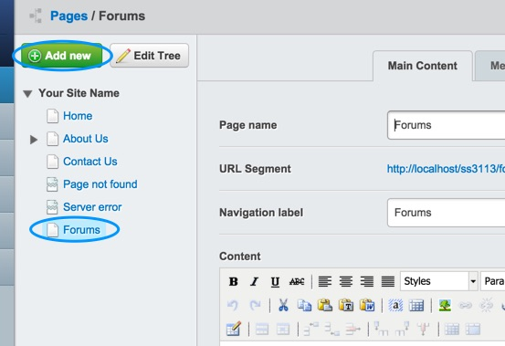
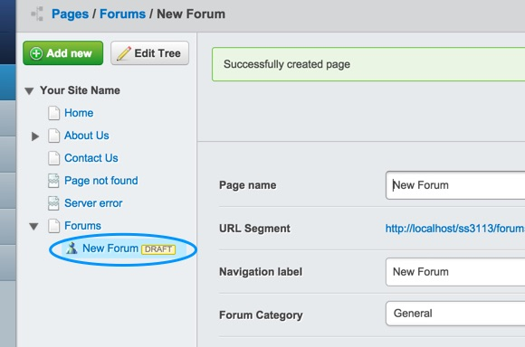
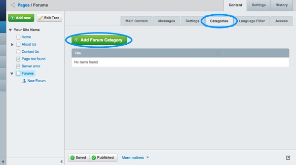
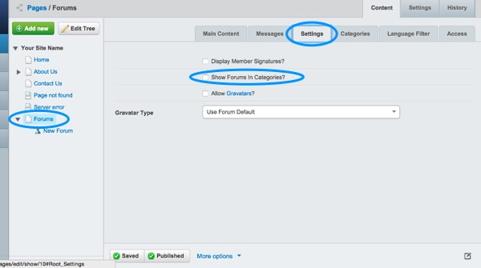
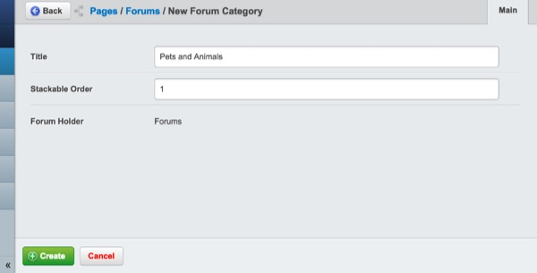
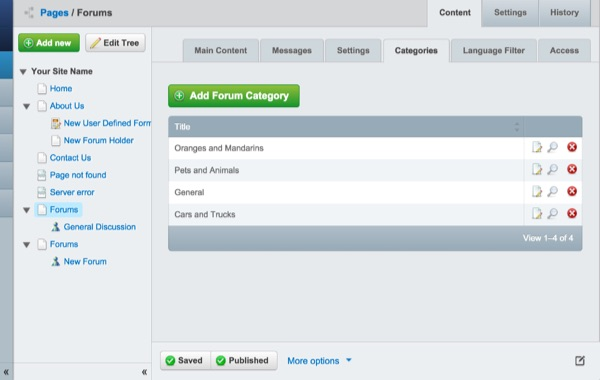

## Setup

### Creating a new forum

Click on the new "Forums" Forum Holder page. Now click the "Add new" button at the top of the "site tree" side-pane. Go ahead and select "Forum" from the list and then hit the "Create" button.

You will notice that a new forum page has been created, with the name of "New Forum". 

Once you have created the new forum page it should automatically open up the editing pane.

If you head back to the pages pane you will also notice it has a yellow "losenge" saying "Draft" next to "New Forum". "Draft" pages are new and have never been published.

[note]
### Notes:

Don't worry if you create your forum in the "wrong" place. Pages can be moved and re-ordered easily, and we will cover that under "[Managing Your Site](managing-your-site)".
[/note]
 
### Naming and editing your forum

In the Editing Pane, to edit your forum, you want to click on the "Content" tab if it it not already selected, and then the "Main Content" subtab. 

Here you will be presented with three forms. The first is for the "Page Name" - this will define what the forum will be known as in the CMS, but it will also be used to form the "default" navigation label and URL for the page, though both can be changed manually.

Below it, you will find the Navigation Label. This will define what the forum will show up as when listed in forum page on the public-facing front page of your site. If you fill in the Page Name first, it will automatically put the page name in the navigation label field. It is usually, but not always, a good idea to leave it the same. If you wish to change the navigation label but not the page name, you can do so here.

Finally, there is the Content box. In the content box, you can write a description of the forum's contents. This is optional but helps to eliminate ambiguity.

### Enabling, creating, and using categories

If you have many forums on your site, you may want to organise them by category. For example, if your website was about farming, and had a separate forums for each product, you may want to group them into categories, such as: Fruits, Veggies, Meat & Dairy, and Livestock.

To enable categories, click on the forum holder "Forums" in the left hand "PageTree" Pane. (The forum holder is the root page of all your forums.) In the Editing Pane, click on the "Content" tab, then "Settings". Check the box next to "Show forums in categories," and hit save.

To create categories, click on any of your site's forums in the Contents pane, and click on the "Category" tab on the editing pane. Click on Add Forum Category. This will bring up a pop-up menu where you can add a category title and set a priority for the category. Categories with a higher priority (100 is high, 1 is low) will be listed before lower priority categories. Hit Save. You may enter multiple categories at this time, by typing in additional category names and hitting Save after each one. When you are finished adding categories, close the window.

To sort forums into different categories, click on each forum you wish to sort in the Contents pane, and go to the "Category" tab in the Editing Pane on each one. Select the category you wish each forum to be in, in turn, and hit Save in the bottom right corner of the Editing pane. 

